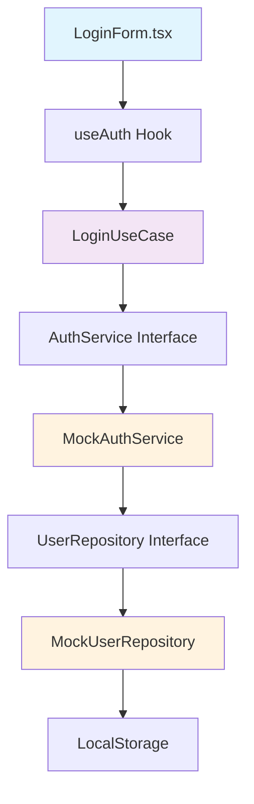
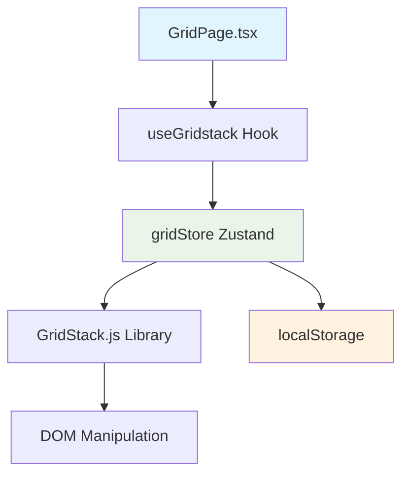

# 🏗️ Arquitectura Hexagonal - Guía Completa del Proyecto

## 📋 Índice

1. [Introducción a la Arquitectura Hexagonal](#introducción)
2. [Estructura General del Proyecto](#estructura-general)
3. [Capas de la Arquitectura](#capas-de-la-arquitectura)
4. [Documentación Detallada por Carpeta](#documentación-por-carpeta)
5. [Flujo de Datos](#flujo-de-datos)
6. [Ejemplos Prácticos](#ejemplos-prácticos)
7. [Beneficios de esta Arquitectura](#beneficios)

---

## 🎯 Introducción

Este proyecto implementa una **Arquitectura Hexagonal** (también conocida como Ports & Adapters) que separa claramente las responsabilidades y hace el código más mantenible, testeable y escalable. La arquitectura está inspirada en los principios de [Domain-Driven Design (DDD)](https://medium.com/@alessandro.traversi/hexagonal-architecture-structure-example-7ea1d998954e) y [Clean Architecture](https://dev.to/dyarleniber/hexagonal-architecture-and-clean-architecture-with-examples-48oi).

### 🔍 Principios Fundamentales

- **Separación de responsabilidades**: Cada capa tiene un propósito específico
- **Inversión de dependencias**: Las capas internas no dependen de las externas
- **Testabilidad**: Facilita las pruebas unitarias y de integración
- **Flexibilidad**: Permite cambiar implementaciones sin afectar el core del negocio

---

## 📁 Estructura General del Proyecto

```
dashboard-grid/
├── src/
│   ├── application/           # 🎯 Casos de uso y lógica de aplicación
│   ├── domain/               # 💎 Núcleo del negocio (entidades, servicios)
│   ├── infrastructure/       # 🔧 Implementaciones concretas
│   ├── presentation/         # 🎨 Interfaz de usuario y componentes React
│   └── shared/              # 🔄 Utilidades y recursos compartidos
├── public/                   # 📂 Archivos estáticos
└── [archivos de configuración]
```

---

## 🏛️ Capas de la Arquitectura

### 🔵 Core (Núcleo)

- **Domain**: Entidades y reglas de negocio puras
- **Application**: Casos de uso que orquestan el dominio

### 🔴 Adapters (Adaptadores)

- **Infrastructure**: Implementaciones de persistencia y servicios externos
- **Presentation**: Componentes de UI y lógica de presentación

### 🟡 Shared (Compartido)

- **Shared**: Utilidades, tipos y constantes usadas en múltiples capas

---

## 📖 Documentación Detallada por Carpeta

### 🎯 `/src/application/` - Capa de Aplicación

**Propósito**: Contiene los casos de uso que orquestan las operaciones del dominio.

**Estructura**:

```
application/
└── use-cases/
    ├── GetCurrentUserUseCase.ts
    └── LoginUseCase.ts
```

#### 📝 Ejemplos del Proyecto:

**`GetCurrentUserUseCase.ts`**

```typescript
// Caso de uso para obtener el usuario actual
// Orquesta la interacción entre el repositorio y las reglas de negocio
export class GetCurrentUserUseCase {
  constructor(private userRepository: UserRepository) {}

  async execute(): Promise<User | null> {
    return await this.userRepository.getCurrentUser();
  }
}
```

**`LoginUseCase.ts`**

```typescript
// Caso de uso para el proceso de autenticación
// Coordina la validación y persistencia del login
export class LoginUseCase {
  constructor(
    private userRepository: UserRepository,
    private authService: AuthService
  ) {}

  async execute(email: string, password: string): Promise<User> {
    return await this.authService.login(email, password);
  }
}
```

**🎯 Responsabilidades**:

- Orquestar operaciones del dominio
- Coordinar múltiples servicios
- Implementar flujos de trabajo complejos
- Mantener la lógica de aplicación libre de detalles técnicos

---

### 💎 `/src/domain/` - Capa de Dominio

**Propósito**: Núcleo del negocio, contiene las entidades y reglas fundamentales.

**Estructura**:

```
domain/
├── entities/
│   └── User.ts
├── repositories/
│   └── UserRepository.ts
└── services/
    └── AuthService.ts
```

#### 📝 Ejemplos del Proyecto:

**`entities/User.ts`**

```typescript
// Entidad del dominio que representa un usuario
// Contiene las reglas de negocio fundamentales
export interface User {
  id: string;
  email: string;
  name: string;
  role: "admin" | "user";
}

// Reglas de negocio específicas del usuario
export class UserEntity {
  constructor(private user: User) {}

  isAdmin(): boolean {
    return this.user.role === "admin";
  }

  canAccessDashboard(): boolean {
    return this.isAdmin() || this.user.role === "user";
  }
}
```

**`repositories/UserRepository.ts`**

```typescript
// Puerto (interface) que define cómo acceder a usuarios
// Define el contrato sin implementación específica
export interface UserRepository {
  getCurrentUser(): Promise<User | null>;
  findByEmail(email: string): Promise<User | null>;
  save(user: User): Promise<void>;
}
```

**`services/AuthService.ts`**

```typescript
// Servicio de dominio para lógica de autenticación
// Contiene reglas de negocio relacionadas con autenticación
export interface AuthService {
  login(email: string, password: string): Promise<User>;
  logout(): Promise<void>;
  isAuthenticated(): boolean;
}
```

**🎯 Responsabilidades**:

- Definir entidades del negocio
- Establecer reglas de dominio
- Crear contratos (interfaces) para servicios
- Mantener la lógica de negocio pura

---

### 🔧 `/src/infrastructure/` - Capa de Infraestructura

**Propósito**: Implementaciones concretas de los puertos definidos en el dominio.

**Estructura**:

```
infrastructure/
├── di/
│   └── Container.ts
└── repositories/
    └── MockUserRepository.ts
```

#### 📝 Ejemplos del Proyecto:

**`repositories/MockUserRepository.ts`**

```typescript
// Implementación concreta del puerto UserRepository
// Simula una base de datos con datos en memoria
export class MockUserRepository implements UserRepository {
  private users: User[] = [
    {
      id: "1",
      email: "admin@example.com",
      name: "Admin User",
      role: "admin",
    },
    {
      id: "2",
      email: "john.doe@example.com",
      name: "John Doe",
      role: "user",
    },
  ];

  async getCurrentUser(): Promise<User | null> {
    // Simula obtener usuario de localStorage
    const stored = localStorage.getItem("currentUser");
    return stored ? JSON.parse(stored) : null;
  }

  async findByEmail(email: string): Promise<User | null> {
    return this.users.find((user) => user.email === email) || null;
  }

  async save(user: User): Promise<void> {
    localStorage.setItem("currentUser", JSON.stringify(user));
  }
}
```

**`di/Container.ts`**

```typescript
// Contenedor de inyección de dependencias
// Configura las implementaciones concretas
export class Container {
  private static userRepository: UserRepository;
  private static authService: AuthService;

  static getUserRepository(): UserRepository {
    if (!this.userRepository) {
      this.userRepository = new MockUserRepository();
    }
    return this.userRepository;
  }

  static getAuthService(): AuthService {
    if (!this.authService) {
      this.authService = new MockAuthService(this.getUserRepository());
    }
    return this.authService;
  }
}
```

**🎯 Responsabilidades**:

- Implementar los puertos del dominio
- Manejar persistencia de datos
- Integrar servicios externos
- Configurar inyección de dependencias

---

### 🎨 `/src/presentation/` - Capa de Presentación

**Propósito**: Interfaz de usuario y lógica de presentación específica de React.

**Estructura**:

```
presentation/
├── components/
│   ├── auth/
│   │   ├── LoginForm.tsx
│   │   └── ProtectedRoute.tsx
│   ├── grid/
│   │   ├── GridWidget.tsx
│   │   └── widgets/
│   │       ├── UserStatsWidget.tsx
│   │       ├── UserTableWidget.tsx
│   │       ├── UserActivityWidget.tsx
│   │       ├── UserGrowthWidget.tsx
│   │       ├── UserLocationsWidget.tsx
│   │       └── CustomWidget.tsx
│   └── layout/
│       ├── AppLayout.tsx
│       ├── AppSidebar.tsx
│       └── Navbar.tsx
├── hooks/
│   ├── useAuth.ts
│   ├── useGridstack.ts
│   └── useNavigationGuard.ts
├── pages/
│   ├── DashboardPage.tsx
│   ├── GridPage.tsx
│   └── LoginPage.tsx
└── stores/
    ├── authStore.ts
    └── gridStore.ts
```

#### 📝 Ejemplos del Proyecto:

**`components/auth/LoginForm.tsx`**

```typescript
// Componente de presentación para el formulario de login
// Usa casos de uso del dominio a través de hooks
export const LoginForm: React.FC = () => {
  const { login } = useAuth();

  const handleSubmit = async (data: LoginFormData) => {
    try {
      // Utiliza el caso de uso a través del hook
      await login(data.email, data.password);
      navigate("/dashboard");
    } catch (error) {
      setError("Credenciales inválidas");
    }
  };

  return <form onSubmit={handleSubmit}>{/* JSX del formulario */}</form>;
};
```

**`hooks/useAuth.ts`**

```typescript
// Hook personalizado que conecta la UI con los casos de uso
// Abstrae la lógica de autenticación para los componentes
export const useAuth = () => {
  const loginUseCase = new LoginUseCase(
    Container.getUserRepository(),
    Container.getAuthService()
  );

  const login = async (email: string, password: string) => {
    const user = await loginUseCase.execute(email, password);
    // Actualizar estado de la aplicación
    useAuthStore.getState().setUser(user);
    return user;
  };

  return { login, logout, user, isAuthenticated };
};
```

**`stores/gridStore.ts`**

```typescript
// Store de Zustand para el estado de los widgets
// Maneja la lógica de presentación específica del grid
export const useGridStore = create<GridState>()(
  persist(
    (set, get) => ({
      widgets: initialWidgets,
      isDragging: false,

      updateWidgetPosition: (id, x, y, w, h) => {
        set((state) => ({
          widgets: state.widgets.map((widget) =>
            widget.id === id ? { ...widget, x, y, w, h } : widget
          ),
        }));
      },

      toggleWidgetVisibility: (id) => {
        // Lógica para ocultar/mostrar widgets manteniendo posición
        const state = get();
        const widget = state.widgets.find((w) => w.id === id);

        if (widget && widget.visible) {
          // Sincronizar posición antes de ocultar
          syncPositionFromDOM(id);
        }

        set((state) => ({
          widgets: state.widgets.map((widget) =>
            widget.id === id ? { ...widget, visible: !widget.visible } : widget
          ),
        }));
      },
    }),
    { name: "grid-storage" }
  )
);
```

**`components/grid/widgets/UserStatsWidget.tsx`**

```typescript
// Widget específico para mostrar estadísticas de usuarios
// Componente de presentación puro con validación de datos
export const UserStatsWidget: React.FC<UserStatsWidgetProps> = ({ data }) => {
  // Validación de datos en la capa de presentación
  if (!data || typeof data !== "object") {
    return <ErrorDisplay message="No hay datos estadísticos disponibles" />;
  }

  const stats = [
    {
      key: "total",
      value: (data.totalUsers || 0).toLocaleString(),
      label: "Total Clientes",
      color: "text-blue-600",
    },
    // ... más estadísticas
  ];

  return (
    <div className="grid grid-cols-2 gap-4">
      {stats.map((stat) => (
        <div key={stat.key} className="text-center">
          <p className={`text-2xl font-bold ${stat.color}`}>{stat.value}</p>
          <p className="text-sm text-gray-600">{stat.label}</p>
        </div>
      ))}
    </div>
  );
};
```

**🎯 Responsabilidades**:

- Renderizar la interfaz de usuario
- Manejar eventos del usuario
- Gestionar estado de presentación
- Coordinar con casos de uso a través de hooks

---

### 🔄 `/src/shared/` - Recursos Compartidos

**Propósito**: Utilidades, tipos y constantes usadas en múltiples capas.

**Estructura**:

```
shared/
├── components/
│   └── ui/
│       ├── button.tsx
│       ├── input.tsx
│       ├── sidebar.tsx
│       └── [otros componentes UI]
├── constants/
│   └── widget.constants.ts
├── styles/
│   └── gridstack.css
├── types/
│   └── widget.types.ts
└── utils/
    ├── sweetAlert.ts
    └── utils.ts
```

#### 📝 Ejemplos del Proyecto:

**`types/widget.types.ts`**

```typescript
// Tipos compartidos para widgets
// Define contratos de datos usados en múltiples capas
export interface GridWidgetData extends GridPosition {
  id: string;
  title: string;
  type: WidgetType;
  data: WidgetData;
  visible: boolean;
}

export type WidgetType =
  | "user-table"
  | "user-stats"
  | "user-activity"
  | "user-growth"
  | "user-locations"
  | "custom";

export interface UserStatsData {
  totalUsers: number;
  activeUsers: number;
  newUsersToday: number;
  adminUsers: number;
}
```

**`constants/widget.constants.ts`**

```typescript
// Constantes de configuración para widgets
// Centraliza valores de configuración
export const WIDGET_CONFIG = {
  GRID: {
    CELL_HEIGHT: 70,
    COLUMNS: 6,
    MARGIN: 8,
    MIN_ROW: 1,
  },
  PAGINATION: {
    ITEMS_PER_PAGE: 5,
    DEFAULT_PAGE: 1,
  },
} as const;

export const WIDGET_DEFAULTS = {
  POSITIONS: {
    "widget-1": { x: 0, y: 0, w: 6, h: 4 },
    "widget-2": { x: 0, y: 4, w: 3, h: 2 },
    // ... más posiciones por defecto
  },
} as const;
```

**`utils/sweetAlert.ts`**

```typescript
// Utilidades para alertas y confirmaciones
// Centraliza la lógica de notificaciones
export const ProjectAlerts = {
  layoutSaved: () =>
    showSuccess(
      "Layout Guardado",
      "La configuración de widgets se ha guardado correctamente"
    ),

  confirm: (title: string, text: string, confirmText = "Confirmar") =>
    Swal.fire({
      title,
      text,
      icon: "question",
      showCancelButton: true,
      confirmButtonText: confirmText,
      cancelButtonText: "Cancelar",
    }),

  success: (title: string, text?: string) =>
    Swal.fire({
      title,
      text,
      icon: "success",
      confirmButtonText: "OK",
    }),
};
```

**`utils/utils.ts`**

```typescript
// Utilidades generales para el proyecto
// Funciones helper reutilizables
import { type ClassValue, clsx } from "clsx";
import { twMerge } from "tailwind-merge";

export function cn(...inputs: ClassValue[]) {
  return twMerge(clsx(inputs));
}
```

**🎯 Responsabilidades**:

- Definir tipos y interfaces compartidas
- Centralizar constantes de configuración
- Proveer utilidades reutilizables
- Mantener componentes UI genéricos

---

## 🔄 Flujo de Datos

### 📊 Ejemplo: Login de Usuario



### 🎯 Ejemplo: Gestión de Widgets



---

## 🛠️ Ejemplos Prácticos

### 🔍 Caso 1: Agregar un Nuevo Widget

**1. Definir el tipo en Shared**:

```typescript
// shared/types/widget.types.ts
export interface NewWidgetData {
  metric: number;
  description: string;
}
```

**2. Crear el componente en Presentation**:

```typescript
// presentation/components/grid/widgets/NewWidget.tsx
export const NewWidget: React.FC<{ data: NewWidgetData }> = ({ data }) => {
  return (
    <div>
      <h3>{data.metric}</h3>
      <p>{data.description}</p>
    </div>
  );
};
```

**3. Actualizar el store**:

```typescript
// presentation/stores/gridStore.ts
const newWidget: GridWidgetData = {
  id: "widget-new",
  title: "Nuevo Widget",
  type: "new-widget",
  data: { metric: 100, description: "Descripción" },
  visible: true,
  x: 0,
  y: 0,
  w: 3,
  h: 2,
};
```

### 🔍 Caso 2: Cambiar de Mock a API Real

**1. Crear nueva implementación en Infrastructure**:

```typescript
// infrastructure/repositories/ApiUserRepository.ts
export class ApiUserRepository implements UserRepository {
  async getCurrentUser(): Promise<User | null> {
    const response = await fetch("/api/user/current");
    return response.json();
  }

  async findByEmail(email: string): Promise<User | null> {
    const response = await fetch(`/api/users?email=${email}`);
    return response.json();
  }
}
```

**2. Actualizar el Container**:

```typescript
// infrastructure/di/Container.ts
static getUserRepository(): UserRepository {
  // Cambiar de MockUserRepository a ApiUserRepository
  return new ApiUserRepository();
}
```

**✅ Sin cambios necesarios en**:

- Domain (interfaces siguen igual)
- Application (casos de uso sin cambios)
- Presentation (componentes sin cambios)

---

## 🎯 Beneficios de esta Arquitectura

### ✅ **Mantenibilidad**

- **Separación clara**: Cada capa tiene responsabilidades específicas
- **Bajo acoplamiento**: Los cambios en una capa no afectan otras
- **Alta cohesión**: Elementos relacionados están agrupados

### ✅ **Testabilidad**

- **Mocking fácil**: Las interfaces permiten crear mocks simples
- **Pruebas unitarias**: Cada capa se puede probar independientemente
- **Pruebas de integración**: Los puertos facilitan las pruebas end-to-end

### ✅ **Flexibilidad**

- **Cambio de tecnología**: Se puede cambiar React por Vue sin afectar el dominio
- **Múltiples adaptadores**: Puede tener web, mobile, CLI usando el mismo core
- **Evolución gradual**: Se pueden introducir cambios incrementalmente

### ✅ **Escalabilidad**

- **Equipos paralelos**: Diferentes equipos pueden trabajar en diferentes capas
- **Microservicios**: Fácil migración a arquitectura distribuida
- **Nuevas funcionalidades**: Agregar features sin romper existentes

---

## 📚 Referencias y Recursos

- [Hexagonal Architecture Structure Example](https://medium.com/@alessandro.traversi/hexagonal-architecture-structure-example-7ea1d998954e)
- [Hexagonal Architecture and Clean Architecture with Examples](https://dev.to/dyarleniber/hexagonal-architecture-and-clean-architecture-with-examples-48oi)
- [Towards Hexagonal Architecture - Folder Structure](https://codeartify.substack.com/p/folder-structures)

---

## 🚀 Próximos Pasos

1. **Agregar más widgets**: Seguir el patrón establecido
2. **Implementar API real**: Cambiar MockUserRepository por ApiUserRepository
3. **Agregar tests**: Implementar pruebas unitarias para cada capa
4. **Mejorar tipos**: Hacer más específicos los tipos de TypeScript
5. **Documentar casos de uso**: Agregar más documentación para cada use case

---

_Esta documentación está viva y debe actualizarse conforme evoluciona el proyecto. Cada desarrollador que agregue funcionalidades debe mantener esta guía actualizada._
